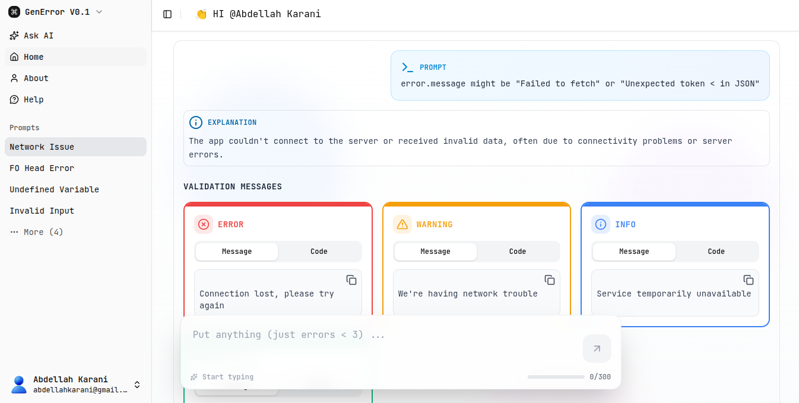

<div align="center">

a project was a platform to simplify error handling for users.
Sometimes we get errors like “error.message might be ‘Failed to fetch’,” but we don’t know what message to show to the user.
I faced this problem many times, and by using free LLM APIs and the MERN stack, I finally found a solution.

[](https://www.typescriptlang.org/)
[](https://react.dev/)
[](https://www.prisma.io/)
[](https://www.mongodb.com/)
[](https://expressjs.com/)
[](https://ui.shadcn.com/)

</div>


## Images

### Login


### Home



## Plans


## Help


## To Contribute

### Clone and Setup

```bash
# Clone the repository
git clone git@github.com:KaraniAbdellah/GenError.git

# Install dependencies for frontend
cd app/frontend
npm install

# Install dependencies for backend
cd app/backend
npm install
```

### Running the Application

**Run the Frontend:**
```bash
cd frontend
npm run dev
```

**Run the BFF (Backend):**
```bash
cd backend
nodemon app.ts
```
**NOTE: make sure to have npm and nodejs installed**

**made with love by <a href="https://www.linkedin.com/in/abdellah-karani-965928294/">ME</a>**
